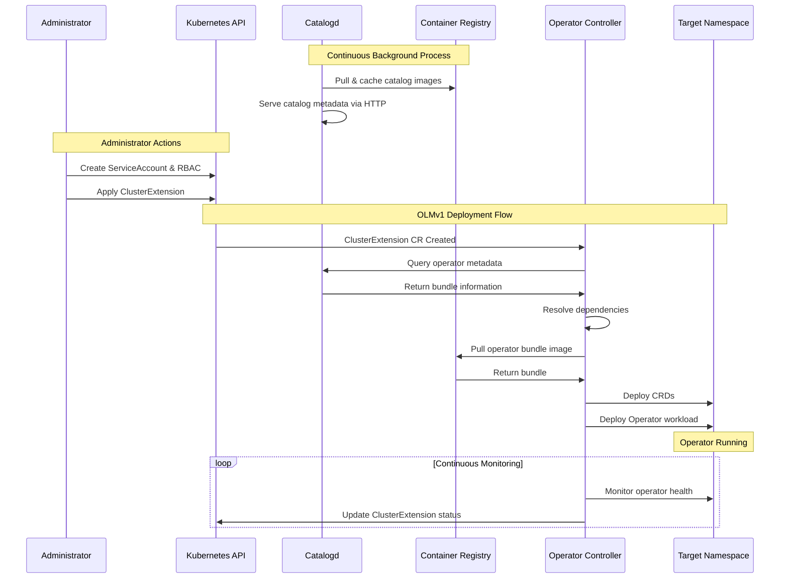

# OLMv1 Case Study

> **Disclaimer**: This repo contains AI-generated content using Cursor / Gemini AI.

A comprehensive case study and reference implementation for deploying Kubernetes operators using Operator Lifecycle Manager V1 (OLMv1).

## Table of Contents

- [Overview](#overview)
- [Architecture](#architecture)
- [Key Components](#key-components)
- [Deployment Flow](#deployment-flow)
- [Sequence Diagram](#sequence-diagram)
- [Project Structure](#project-structure)
- [Getting Started](#getting-started)
- [Examples](#examples)
- [Documentation](#documentation)
- [Related Projects](#related-projects)

## Overview

The Operator Lifecycle Manager V1 (OLMv1) is a declarative, pull-based system designed for managing Kubernetes operators with a focus on simplicity and security. This repository provides a comprehensive case study with practical examples, deployment guides, and best practices for implementing OLMv1 in production environments.

For more information, visit the official documentation: [openshift/operator-framework-operator-controller](https://github.com/openshift/operator-framework-operator-controller)

## Architecture

OLMv1 follows a declarative architecture where administrators define desired states through Custom Resources, and the system automatically orchestrates operator lifecycles. The architecture is built around several core components that work together to provide a robust operator management solution.

## Key Components

| Component | Description | Purpose |
|-----------|-------------|---------|
| **Operator Controller** | Core OLMv1 component | Watches ClusterExtension CRs and orchestrates operator lifecycle |
| **catalogd** | Metadata service | Hosts and serves operator metadata from File-Based Catalogs |
| **File-Based Catalogs (FBCs)** | Lightweight metadata collections | Source of truth for operator bundles, channels, and update graphs |

## Deployment Flow

The OLMv1 deployment process follows a logical sequence with sophisticated background orchestration. Here's what happens from the moment an administrator applies a ClusterExtension to when the operator becomes operational:

### Administrator Applies ClusterExtension

```yaml
apiVersion: olm.operatorframework.io/v1
kind: ClusterExtension
metadata:
  name: argocd-operator
spec:
  namespace: argocd
  serviceAccount:
    name: argocd-operator-sa
  source:
    sourceType: Catalog
    catalog:
      packageName: argocd-operator
      version: "0.6.0"
```

### Background Process Flow

#### Phase 1: Catalogd Operations (Continuous Background Process)

**Before any ClusterExtension is applied**, Catalogd continuously manages catalog content:

1. **Catalog Ingestion**
   - Catalogd Controller watches for ClusterCatalog resources
   - Pulls catalog images from Container Registry
   - Unpacks catalog data into Content Cache

2. **HTTP Server Ready**
   - Catalogd HTTP Server serves catalog metadata
   - Provides REST API for querying packages, channels, and bundles
   - Stores unpacked catalog information for fast retrieval

3. **Continuous Synchronization**
   - Monitors catalog sources for updates
   - Refreshes cached catalog data periodically
   - Ensures metadata availability for Operator Controller queries

#### Phase 2: ClusterExtension Applied - Operator Controller Takes Over

##### Step 1: Controller Detection

- Operator Controller detects the new ClusterExtension CR via Kubernetes watch
- Extension Controller component begins reconciliation

##### Step 2: Catalog Query

- Extension Controller queries Catalogd HTTP Server for operator metadata
- Requests package information for `argocd-operator` version `0.6.0`
- Catalogd serves data from its Content Cache

##### Step 3: Dependency Resolution

- Resolver component analyzes bundle metadata
- Filters bundle references based on version constraints
- Resolves dependencies and validates compatibility
- Determines the exact bundle image to deploy

##### Step 4: Catalog Cache Update

- Saves resolved catalog information to Catalog Cache
- Stores bundle metadata for future reconciliation
- Maintains cache for faster subsequent operations

##### Step 5: Bundle Retrieval

- Extension Controller pulls Operator Bundle Image from Container Registry
- Downloads the specific bundle version (e.g., `quay.io/operator-framework/argocd-operator-bundle:v0.6.0`)
- Unpacks bundle contents

##### Step 6: Bundle Processing

- Stores unpacked bundle in Bundle Cache
- Extracts manifests (CRDs, Deployments, Services, etc.)
- Validates bundle structure and contents

##### Step 7: Resource Deployment

- Uses the specified ServiceAccount (`argocd-operator-sa`) for deployment
- Applies resources to target namespace (`argocd`)
- Deploys in order:
  1. Custom Resource Definitions (CRDs)
  2. RBAC resources (if included in bundle)
  3. Service accounts and config maps
  4. Operator Deployment
  5. Supporting resources (Services, etc.)

##### Step 8: Status Monitoring

- Continuously monitors deployed resources
- Updates ClusterExtension status conditions
- Reports health and reconciliation state
- Ensures desired state matches actual state

#### Phase 3: Operator Active

- Operator pods are running in the target namespace
- Operator uses its ServiceAccount with configured RBAC permissions
- Operator begins managing its Custom Resources
- Operator Controller continues monitoring for updates or changes

### Visual Architecture Reference


*The diagram above shows the complete OLMv1 architecture and data flow between components.*

### Key Differences from OLMv0

- **Declarative**: Single ClusterExtension CR defines entire operator lifecycle
- **Simplified**: No Subscription/InstallPlan complexity
- **Efficient**: Local caching reduces registry queries
- **ServiceAccount Control**: Administrators specify exact ServiceAccount for deployment

## Sequence Diagram



## Project Structure

```text
OLMv1-CaseStudy/
├── docs/                              # Comprehensive documentation
│   ├── DEPLOYMENT.md                  # Step-by-step deployment guide
│   └── COMMAND_REFERENCE.md           # Manual command reference
├── examples/                          # Example configurations
│   └── yamls/                         # Raw YAML manifests
│       ├── 00-namespace.yaml          # Namespace creation
│       ├── 01-serviceaccount.yaml     # ServiceAccount for operator
│       ├── 02-clusterrole.yaml        # ClusterRole with permissions
│       ├── 03-clusterrolebinding.yaml # ClusterRoleBinding
│       └── 04-clusterextension.yaml   # ClusterExtension for operator
├── images/                            # Architecture diagrams
│   └── OLMv1 Architecture Diagram.svg # Complete architecture flow
├── Templates/                         # Reusable templates
│   ├── CustomRoles/                   # Custom RBAC templates
│   │   ├── 00-rolebinding.yaml        # RoleBinding template
│   │   ├── 01-clusterrole.yaml        # ClusterRole template
│   │   └── 02-clusterrolebinding.yaml # ClusterRoleBinding template
│   └── OLMv1 Resources/               # OLMv1 resource templates
│       ├── 01-clustercatalog.yaml     # ClusterCatalog template
│       └── 02-clusterextension.yaml   # ClusterExtension template
└── README.md                          # This file
```

## Getting Started

### Prerequisites

- Kubernetes cluster (1.24+)
- OLMv1 installed on the cluster
- `kubectl` configured with appropriate permissions
- Basic understanding of Kubernetes operators

### Quick Start

1. **Review the Documentation**

   Start with the [Deployment Guide](docs/DEPLOYMENT.md) to understand the deployment process.

2. **Explore Examples**

   Browse the `examples/` directory to see different deployment patterns:
   - `examples/yamls/` - Basic YAML manifests for manual deployment

3. **Choose a Deployment Method**

   - **Manual YAML**: Use the examples in `examples/yamls/` for step-by-step deployment
   - **Helm Chart**: See the [OLMv1 Helm Chart](https://github.com/JoeyJoHa/RH-OLMv1-Helm) repository for simplified deployment
   - **RBAC Manager Tool**: Use the [OLMv1 RBAC Manager](https://github.com/JoeyJoHa/RH-OLMv1-RBAC-Manager-Tool) for automated RBAC extraction and generation

4. **Deploy Your First Operator**

   Follow the step-by-step guide in [docs/DEPLOYMENT.md](docs/DEPLOYMENT.md)

## Examples

### Basic Operator Deployment

The `examples/yamls/` directory contains a complete set of manifests for deploying an operator:

```bash
# Deploy namespace
kubectl apply -f examples/yamls/00-namespace.yaml

# Deploy ServiceAccount
kubectl apply -f examples/yamls/01-serviceaccount.yaml

# Deploy RBAC
kubectl apply -f examples/yamls/02-clusterrole.yaml
kubectl apply -f examples/yamls/03-clusterrolebinding.yaml

# Deploy operator
kubectl apply -f examples/yamls/04-clusterextension.yaml
```

### Helm Deployment

For Helm-based deployments, see the [OLMv1 Helm Chart](https://github.com/JoeyJoHa/RH-OLMv1-Helm) repository which includes:

- Complete Helm chart templates
- Example values files
- Deployment instructions

### RBAC Manager Tool

For automated RBAC extraction and generation, see the [OLMv1 RBAC Manager](https://github.com/JoeyJoHa/RH-OLMv1-RBAC-Manager-Tool) repository which includes:

- Tool documentation and usage
- Configuration examples
- Sample generated outputs

## Documentation

### Core Documentation

- **[Deployment Guide](docs/DEPLOYMENT.md)**: Comprehensive deployment instructions
  - Step-by-step YAML deployment
  - Helm chart deployment
  - Cleanup procedures
  - Monitoring and verification

- **[Command Reference](docs/COMMAND_REFERENCE.md)**: Manual commands for advanced users
  - OPM render commands
  - catalogd API queries
  - Debugging techniques

### Templates

The `Templates/` directory provides reusable templates for common scenarios:

- **CustomRoles/**: RBAC templates for custom operator permissions
- **OLMv1 Resources/**: Base templates for ClusterCatalog and ClusterExtension

### Use Cases

This case study covers several common deployment scenarios:

1. **Basic Operator Deployment**: Simple operator installation with minimal RBAC
2. **Namespace-Scoped Operators**: Operators limited to specific namespaces
3. **Cluster-Scoped Operators**: Operators with cluster-wide permissions
4. **Multi-Tenant Deployments**: Isolating operators in different namespaces
5. **GitOps Integration**: Declarative operator management with GitOps tools

## Best Practices

### Security

1. **Least Privilege RBAC**: Grant only the minimum required permissions
2. **ServiceAccount Isolation**: Use dedicated ServiceAccounts per operator

### Deployment

1. **Version Pinning**: Always specify exact operator versions
2. **Testing**: Test deployments in non-production environments first
3. **Monitoring**: Set up monitoring for operator health and performance
4. **Documentation**: Document custom configurations and decisions

### Maintenance

1. **Update Strategy**: Plan operator updates carefully
2. **Backup**: Maintain backups of operator configurations
3. **Rollback Plan**: Have a rollback strategy for failed updates
4. **Change Management**: Use version control for all configurations

## Troubleshooting

### Common Issues

#### Operator Not Installing

```bash
# Check ClusterExtension status
kubectl describe clusterextension <operator-name>

# Check operator-controller logs
kubectl logs -n olmv1-system -l app=operator-controller

# Verify catalog is available
kubectl get clustercatalog
```

#### RBAC Permission Errors

```bash
# Verify ServiceAccount
kubectl get serviceaccount <sa-name> -n <namespace>

# Check bindings
kubectl get rolebinding,clusterrolebinding | grep <operator-name>

# Review RBAC rules
kubectl describe clusterrole <role-name>
```

#### Catalog Issues

```bash
# Check catalog status
kubectl describe clustercatalog <catalog-name>

# Query catalog content
kubectl get packages
```

See the [Deployment Guide](docs/DEPLOYMENT.md) for more troubleshooting tips.

## Related Projects

- **[OLMv1 Helm Chart](https://github.com/JoeyJoHa/RH-OLMv1-Helm)**: Helm chart for simplified operator deployment
- **[OLMv1 RBAC Manager](https://github.com/JoeyJoHa/RH-OLMv1-RBAC-Manager-Tool)**: Tool for automated RBAC extraction and management

## Resources

### Official Documentation

- [OLMv1 Documentation](https://github.com/openshift/operator-framework-operator-controller)
- [Kubernetes Operators](https://kubernetes.io/docs/concepts/extend-kubernetes/operator/)
- [Operator Framework](https://operatorframework.io/)

**Note**: This is a case study and reference implementation. Always review and test configurations in your own environment before production use.
